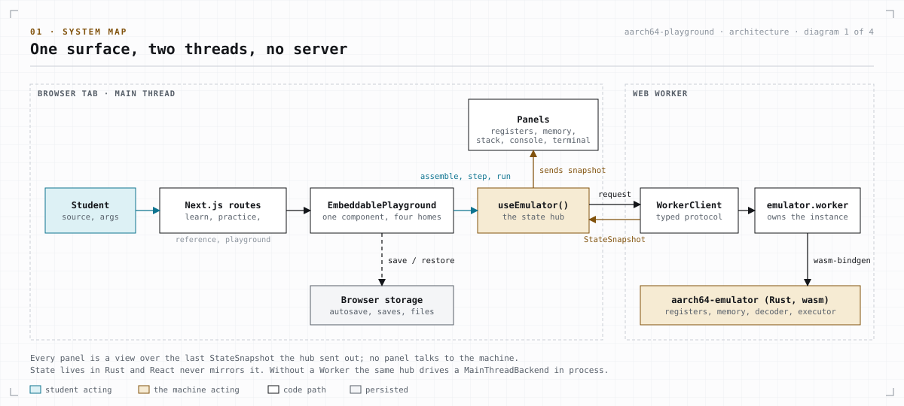
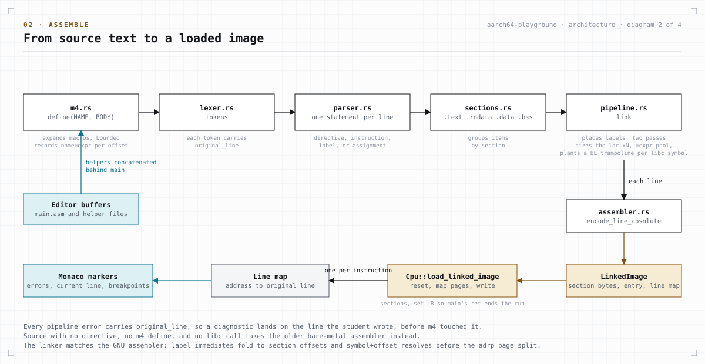
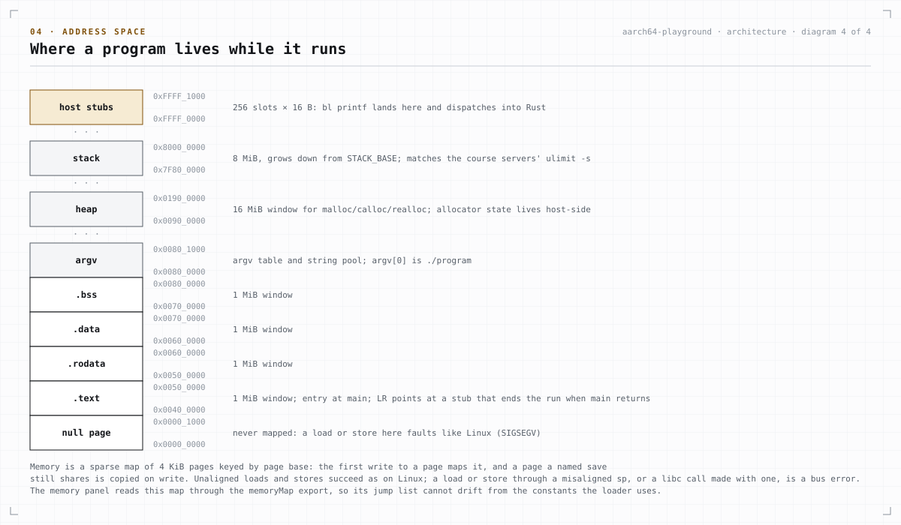
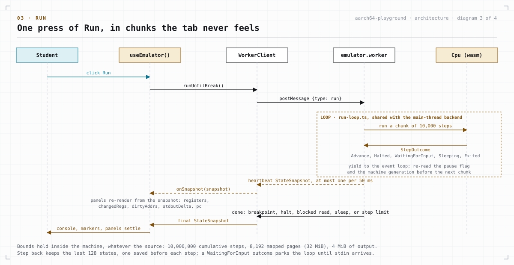

# Architecture

The site has no server code. Every page is a static file, and the emulator, a
Rust interpreter compiled to WebAssembly (wasm), runs inside the browser tab.
This doc explains how the parts fit together and why they are built this way.
[Where things live](#where-things-live) says where to make the common
changes, [CONTRIBUTING.md](CONTRIBUTING.md) has the folder layout, and
[features.md](features.md) maps each feature to its files.

## Two halves

- `emulator/` is the Rust crate `aarch64-emulator`. Nothing in it depends on a
  browser: the `#[wasm_bindgen]` wrappers in `lib.rs` are the only code that
  touches JavaScript types, so the whole crate builds and tests natively.
  wasm-pack turns it into `web/lib/wasm/` for the site and `web/lib/wasm-node/`
  for the tests.
- `web/` is the Next.js site. The emulator's state lives in Rust. React reads
  it after every change and never keeps its own copy of the CPU.

## Where things live

Where to make the most common changes. [features.md](features.md) lists the
files behind every feature.

### The emulator

The four largest modules are a parent file plus a folder of the same name:
`decoder.rs` and `decoder/`, `executor.rs` and `executor/`, `assembler.rs`
and `assembler/`, `cpu.rs` and `cpu/`. The parent holds the shared types and
the dispatch, and each file in the folder holds one kind of instruction or
one job. All paths below are under `emulator/src/`.

| To change | Edit |
| --- | --- |
| The bits an instruction assembles to | its arm in `encode_line` (`assembler.rs`) and its encoder in `assembler/` (`arith.rs`, `bitwise.rs`, `load_store.rs`, `branch.rs`, `fp.rs`, `simd.rs`, `simd_integer.rs`, `simd_float.rs`) |
| An Advanced SIMD encoding | its row in the tables in `decoder/simd.rs` or `decoder/simd_fp.rs`, which the encoder, the decoder, and the disassembler share |
| How a word decodes | `decoder/`, one file per instruction class (`data_processing.rs`, `load_store.rs`, `branch.rs`, `fp.rs`, `simd.rs`, `simd_fp.rs`) |
| What an instruction does | `executor/`, with the decoder's class names; the flag helpers are in `executor.rs` |
| The list of accepted mnemonics | `SUPPORTED_MNEMONICS` in `assembler.rs`, kept equal to [instruction-reference.md](instruction-reference.md) by a test |
| m4, labels, directives, and linking | `frontend/`: `m4.rs`, `lexer.rs`, `parser.rs`, `expr.rs`, `sections.rs`, `pipeline.rs` |
| A library function such as `printf` or `malloc` | `hosted/`, one file per family: `printf.rs`, `scanf.rs`, `libc.rs`, `stdio.rs`, `heap.rs`, `math.rs`, `ctype.rs`, `callback.rs` |
| A system call or the virtual files | `hosted/syscalls.rs` |
| The step loop and the memory layout | `cpu.rs`; loading in `cpu/loader.rs`, the limits in `cpu/bounds.rs`, input and output in `cpu/system.rs`, breakpoints and step back in `cpu/control.rs` |
| Registers or memory pages | `registers.rs`, `memory.rs` |
| What the site can call | `lib.rs` |

### Lessons, exercises, and pitfalls

[authoring-content.md](authoring-content.md) has the format and the rules
each kind of file must meet.

| To change | Edit |
| --- | --- |
| A lesson | `web/content/lessons/<slug>.json` |
| An exercise or a theory set | `web/content/exercises/<slug>.json`; a coding exercise's reference solution is `web/lib/test/content/exercise-solutions/<slug>.s` |
| The practice topics and their order | `web/lib/content/practice-topics.ts` |
| A pitfall card | `web/lib/content/pitfalls/<group>.ts`; `web/lib/content/pitfall-data.ts` joins the groups |
| An instruction's reference entry | [instruction-reference.md](instruction-reference.md), `web/lib/content/reference-data.ts`, and the hover card in `web/lib/asm/instruction-docs.ts` |

<!-- The site's rows (themes, the watch grammar, the panels, the playground
layout) go here once its files settle. -->

## One playground component

`web/components/playground/EmbeddablePlayground.tsx` is the emulator on every
page: the full playground, the home page's program, and every lesson and
exercise editor. It owns the one `useEmulator()` hook
(`web/lib/emulator/use-emulator.ts`), so a fix to how programs load or run
reaches every page at once.

The full debugger's panels and dialogs live in `FullChromeSurface.tsx`, which
`next/dynamic` loads only on `/playground`. The Monaco editor is loaded the
same way (`lazy-editor.tsx`). The home page draws its program as static text
(`StaticCodeView.tsx`), so it downloads no editor code at all. Both lazy parts
wait for the web fonts before they appear, so a late font swap cannot shift the
page after it has drawn.

The `/learn` and `/practice` index pages receive a short summary row for each
lesson and exercise (`LessonIndexRow`, `ExerciseIndexRow`), not the whole file,
so prompts, starters, and answers stay off the index pages.

## From source to a running program

1. The student presses **assemble**. `use-emulator.ts` calls the backend's
   `assemble`, which reaches `Emulator::assemble_and_load` in
   `emulator/src/lib.rs`.
2. `detect_hosted_mode` picks the path. Source with any directive the parser
   knows, an m4 `define(`, or a `bl` to a library function goes through the
   section-aware pipeline in `emulator/src/frontend/`. Anything else goes
   through the older one-pass assembler in `assembler.rs`, which loads a
   single `.text` section for bare-metal programs.
3. `Cpu::reset` clears the registers, output, input, files, and memory. The
   loader writes each section at its base address and puts the address of a
   return stub in `lr`, so the `ret` that ends `main` stops the program with
   `w0` as the exit code.
4. **step** and **run** call `cpu.step()`, which reports whether the program
   advanced, halted, exited, is waiting for input, or is sleeping. A run
   pauses while it waits for input and carries on when the console sends a
   line.
5. After each call the backend sends a `StateSnapshot`, and React applies it
   in one update.

The pipeline runs m4 (`m4.rs`), the lexer, and the parser, groups the lines by
section, and links (`pipeline.rs`). Linking places the labels, resolves
forward references in two passes, builds the pool that `ldr xN, =label` loads
from, and plants a two-instruction jump for each library function a program
calls. Every error keeps the line number from before m4 ran, so the editor
marks the line the student wrote.

## Encoding and decoding

`assembler.rs` encodes each instruction in one large `match` on the mnemonic.
Each arm carries the constants its instruction needs (opcode bits, operand
rules, the flag-setting variant), so the encoder for any instruction is one
search away and the compiler still checks every arm. Pseudo-instructions such
as `mov`, `cmp`, and `cset` become the real instruction they stand for, so
the executor only sees real encodings. The four largest Advanced SIMD
families are the exception: each family's mnemonics share one arm that looks
the row up by name in a table in `decoder.rs`.

Facts that more than one module needs have one home and a test that walks
them: the condition codes and the register aliases (`sp`, `xzr`, `fp`, `lr`)
in `registers.rs`; the directive names in `parser.rs`; and the load and store
extend keywords, access sizes, floating-point opcodes, and every SIMD
encoding class in `decoder.rs`. The SIMD tables serve both directions, so an
instruction is encoded, decoded, and printed from the same row.

The decoder checks `(word & mask) == pattern` from the most specific pattern
to the least and returns a typed `Instruction`. A word that matches no
supported encoding, including a reserved one inside a class that does match,
decodes as unknown, so the program stops on it instead of running some other
instruction.

## Memory

Memory is a `HashMap<u64, Rc<Vec<u8>>>` of 4 KiB pages. The first write to an
address maps its page. The step-back history shares pages with the live
machine, and a page is copied only when it is written while an older frame
still holds it.

Unaligned loads and stores work, as they do for Linux programs. The one
alignment rule is on `sp`: a load or store through `sp`, or a library call,
while `sp` is not a multiple of 16 stops the program with the bus error Linux
gives. A load or store in the first page (a null pointer) stops it with a
segmentation fault.

The `memoryMap` export in `lib.rs` lists the address bands, built from the
same constants the loader uses, so the memory panel's labels cannot drift
from the real layout.

## Library calls and system calls

`svc #0` reads the system call number from `x8` and runs it in
`emulator/src/hosted/syscalls.rs`. A `bl` to a library function goes through
the jump the linker planted to a stub address at `0xFFFF_0000` and up, where
Rust code in `emulator/src/hosted/` answers the call. Both lists are in
[instruction-reference.md](instruction-reference.md).

A stub reads its arguments the standard AArch64 way (AAPCS64), writes the
result to `x0` or `d0`, and returns to `lr`. On the way back it fills every
register a called function may change (`x0` to `x18`, `v0` to `v7` and `v16`
to `v31`, the top half of `v8` to `v15`, and the flags) with
`0xDEADBEEFDEADBEEF`, apart from the one holding the result, because real
glibc leaves its own values there. If the program then reads one of those
registers before writing it, the console names the call and the register.

Stepping into a library call takes three steps on addresses the student never
wrote: the two instructions of the jump, then the stub. The `hostCallContext`
export finds the `bl` that made the call from `lr`, so the debugger can name
the call and keep the student's `bl` line highlighted. It has to work this out
while the program runs, because one jump serves every call to that function.

## Limits

The site runs programs from strangers, so the emulator enforces its limits
itself, however the program arrived: at most 10 million instructions per run,
32 MiB of mapped memory, an 8 MiB stack, and 4 MiB of output. Each one stops
the program with a plain message, never a crash. [security.md](security.md)
lists them all.

## Step back and save states

Before each step, the emulator records a frame in a ring of the last 128
steps: the registers, memory, and the state of input, files, and the heap.
**back** restores the newest frame. The ring stops recording, and clears,
while a terminal program has the keyboard in raw mode and once a frame's
input and file state passes 4 KiB, so step back never jumps over steps it did
not record. The output is never rolled back, but the count of bytes shown is,
so the console trims itself to what the restored frame had printed. Named
save states live beside the ring, so stepping never pushes one out.

## Keeping the page in step

`use-emulator.ts` owns an `EmulatorBackend` and applies each `StateSnapshot`
(defined in `web/lib/worker/protocol.ts`) in one update. A snapshot carries
the registers and which of them changed, the floating-point and vector
registers, new output, the exit code, whether the program is waiting for
input, the library call a paused program is inside, the memory ranges written,
the files, and a frame counter. The register panel works out which vector
lanes changed by comparing two snapshots itself.

Panels read memory through `getMemory(addr, len)`. A cached range answers at
once; a miss fetches the bytes and redraws when they arrive. The cache clears
on every new frame.

The emulator runs in a Web Worker so a long run cannot freeze the page.
`web/lib/worker/` holds the message types (`protocol.ts`), the worker
(`emulator.worker.ts`), the page's side of it (`client.ts`), and the check
for an error that left the wasm unusable (`dead-instance.ts`). `pickBackend()`
in `web/lib/emulator/backend.ts` uses the worker when the browser has one and
runs the emulator on the page otherwise. Both run the same loop
(`web/lib/emulator/run-loop.ts`): 10,000 steps at a time, checking for pause
between chunks, with a snapshot at most every 50 ms so the panels stay live.

## Where errors show

- An assembly error marks the line in the editor and appears under the
  controls.
- A runtime error, such as an unknown instruction, a bad memory access, a
  misaligned `sp`, or a stack overflow, stops the program and appears under
  the controls.
- If the wasm fails to load, the playground shows the error in place of the
  loading screen.
- A page that throws while drawing shows `web/app/error.tsx` (or
  `global-error.tsx` when the root layout fails), with a retry button and a
  short report to copy.

## Offline

The service worker's source is `web/lib/playground/sw.js`; it is served as
`/sw.js` and registers only over HTTPS or on `localhost`.

- `npm run build` ends with `scripts/write-precache-list.js`, which reads the
  build and writes `web/public/sw.js` (not tracked): the build id, the core
  set (the playground, the `/offline` page, every file under `/_next/static/`,
  the example programs, the icons, and the manifest), and every other
  prerendered page, followed by the worker's source. The list is part of the
  worker itself, so every build's worker is different bytes and a browser's
  update check always sees the new build.
- On install the worker saves the core set in a cache named after the build
  id, all or nothing. Files under `/_next/static/` are named after their
  content, so a copy an older build saved is reused instead of downloaded. A
  new build's worker waits until no page of the old build is open, then
  deletes every other cache, so a page never loads files from another build.
- Pages come from the network first. Offline, a saved page comes from the
  cache, and an unsaved one gets the `/offline` page under its own address.
  The router's page-data requests are not cached; offline they get an empty
  204, so Next drops a prefetch and turns a link click into a full page load.
- **Save every page for offline** (the phone menu, the iPhone install tip, and
  the footer) asks the worker to save the other pages too. A later build saves
  them again on install.
- Only a 2xx answer is stored, and a page only when it carries the worker's
  build id, so the host's bot challenge (a 429) or a newer deploy's page never
  replaces a saved one. A failed update check leaves the installed worker
  serving.

Security headers and input checks are in [security.md](security.md), tests in
[TESTING.md](TESTING.md), and known traps in
[CONTRIBUTING.md](CONTRIBUTING.md#known-traps).
